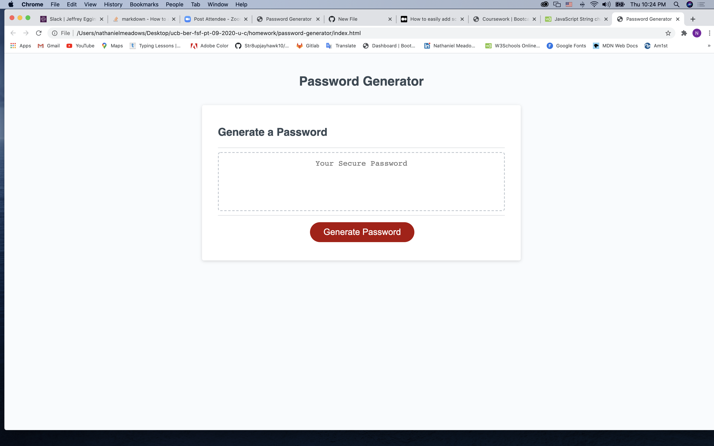

# password-generator
application that generate a random password
generated variable for string format, generarted function to invoke password, parseInt parse a string & return an integer, used prompt command to getPasswordoption, created if statement to check for true or false.
used charAt method to specify character index string, if statement created to alert if characters are denied, four loop used push character option to empty array to be randomly regenrated break indicates to stop loop.
used "join method," creates and returns a new string by concatenating all of the elements in an array, Function used to get random element from an array.
Id #generate element from html. function invoked writePassword / let statement declares a block-scoped local variable getPasswordOption

;